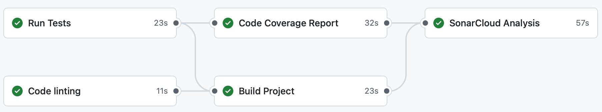

INFOM126 : Automated Software Engineering
=========================================

**Rapport de projet**

Edwyn Eben,
Nathan Lambrechts,
Louca Mathieu,
Florian Stormacq

---

## 1. Introduction

Ce rapport présente une vue d'ensemble du projet 2048-groupe-hms, mettant en oeuvre les pratiques CI/CD et les principes DevOps. Les détails concernant le fonctionnement interne du projet, les contributions individuelles, ainsi qu'une auto-réflexion sur le processus de développement sont également abordés. La repository GitHub associée au projet est accessible à l'adresse suivante : [lien vers le dépôt GitHub](https://github.com/INFOM126-Automated-Software-Engineering/2048-groupe-hms).

## 2. Pipeline mise en place

La pipeline mise en place dans ce projet peut être déclenchée de deux manières principales :

1. **Automatiquement**
   1. Lors d'un push vers la branche `main`.
   2. Lors de la création d'une pull request vers la branche `main`.
   3. Lors de la mise à jour d'une pull request existante vers `main`.
2. **Manuellement**
   1. Via un déclencheur manuel dans l'interface GitHub Actions.

Cette double approche permet de garantir que les modifications critiques sont toujours validées par la pipeline. De plus, l'approche manuelle offre une flexibilité supplémentaire en permettant aux développeurs de tester à la demande, sans nécessiter une modification de code. Cela rend le processus de développement plus flexible sans pour autant le contraindre.

### 2.1 Optimisation du déclenchement automatique

Une optimisation a été mise en place pour éviter l'exécution de la pipeline lors de modifications n'impactant que la documentation, tels que les fichiers Markdown ou le répertoire `docs/*`. Cela permet une économie de ressources ainsi qu'un gain de temps lors de la revue des pull requests de documentation.

### 2.2 Étapes de la pipeline

La pipeline principale est composée de cinq jobs distincts : 

1. **Linting :** Cette étape garantit la qualité du code en vérifiant son style et sa conformité aux normes établies, via l'utilisation de l'outil Maven Formatter.
2. **Tests :** Cette étape exécute les tests unitaires pour vérifier que le code fonctionne comme prévu, également via Maven.
3. **Coverage :** Cette étape génère un rapport de couverture de code à l'aide de JaCoCo, permettant d'évaluer la qualité des tests.
4. **Build :** Cette étape compile le projet pour s'assurer que le code source peut être transformé en un artefact exécutable.
5. **SonarCloud Analysis :** Cette étape analyse la qualité du code en utilisant SonarCloud, fournissant des insights sur la maintenabilité et la sécurité du code.

Le schéma d'exécution des jobs est le suivant : 

{width=75%}

### 2.3 Workflows additionnels

En plus de la pipeline principale, deux workflows additionnels ont été mis en place pour renforcer la sécurité et la maintenance du projet :

1. **Dependabot :** Dependabot a été configuré pour assurer la gestion des dépendances et la mise à jour de celles-ci. Deux fonctionnalités en particulier ont été ajoutées : dependency graph et dependabot alerts. Le premier permettant l'analyse des dépendances Maven et l'autre a été activé pour détecter les vulnérabilités connues dans les bibliothèques tierces. Un fichier `dependabot.yml` a également été ajouté afin de configurer la surveillance des dépendances Maven et de vérifier de manière hebdomadaire si des mises à jour sont disponibles. Dependabot pourra donc proposer des pull requests de mise à jour de dépendances lorsque des versions plus récentes sont détectées. 
2. **CodeQL :** Un workflow de code scanning CodeQL a été mis en place via GitHub Actions. Ce workflow permet d'analyser automatiquement le code source afin de détecter d'éventuelles failles de sécurité ou de mauvaises pratiques.

Ces workflows fonctionnent en parallèle de la pipeline principale et contribuent à maintenir un haut niveau de qualité et de sécurité dans le projet.

## 3. Contributions individuelles

Chaque membre de l'équipe a été responsable de différentes parties du projet, contribuant ainsi individuellement à la réussite collective.

### Edwyn Eben

- Mise en place du template de pull request.
- Création du dossier .github/ISSUE_TEMPLATE pour structurer la gestion des issues.
- Rédaction des templates d’issues Bug Report et Feature Request.

### Nathan Lambrechts

- Activation de la gestion des dépendances avec Dependabot et création de son fichier pour configurer les mises à jour Maven 
- Mise en place du code scanning avec la configuration de CodeQL et l'ajout d'un workflow GitHub Actions pour une analyse automatique du code

### Louca Mathieu

- Intégration de la génération de rapport de code coverage dans le CI/CD. 
- Intégration de SonarCloud au projet. 
- Faire en sorte que le pipeline ne soit pas run si seulement de la documentation est ajoutée. 

### Florian Stormacq

- Mise en place de l'ensemble de règles de protection de la branche `main`.
- Mise en place de la première version de la pipeline CI/CD avec les étapes de linting, build et tests.
- Co-rédaction des fichiers Markdown et du rapport de projet.

## 4. Discussion

Comme tout projet, celui-ci a rencontré des défis et de nombreuses opportunités d'apprentissage. La mise en place d'une pipeline CI/CD a permis de comprendre par la pratique les concepts de l'intégration continue et du déploiement continu, ainsi que l'importance de la qualité du code et des tests automatisés.

Cependant, des améliorations sont encore possibles. En effet, nous avions par exemple eu l'idée initiale d'intégrer une étape de déploiement d’un conteneur Docker pour le projet, afin de permettre un déploiement plus facile de l'application. Néanmoins, en raison de contraintes de temps, cette fonctionnalité n'a pas pu être implémentée dans le cadre de ce projet. 

De plus, certains aspects de ce projet se sont avérés plus complexes que prévu, tels que la mise en place de SonarCloud. Bien que familiarisé une première fois avec dans le cours de INFOM124 (Vérification & Validation Logicielle), une mise en main a été nécessaire et certaines difficultés ont été rencontrées, notamment à la modification des prérequis de sonar pour se lancer dans le CI (initialement nous avions `needs: tests` puis nous avons modifié pour `needs: [build, coverage]`) sauf que cela a créé des soucis pour reconnaitre SonarCloud. 

Nous avons aussi choisi de ne pas toucher au code source du projet, comme cela n'était pas demandé dans les consignes. De ce fait, SonarCloud détecte qu'il y a une condition failed dans le main, que nous avons laissée. Cela pourrait se corriger facilement simplement en rajoutant un override de la méthode hashcode() dans la classe Tile. 

## 5. Annexes

En supplément du workflow principal décrit précédemment, plusieurs fichiers markdown ont été créés pour aider à la gestion du projet et à la contribution des membres :

- `CONTRIBUTING.md` : Ce fichier définit les règles de contribution au projet, incluant les exigences de pull request et les bonnes pratiques de codage.
- `.github/PULL_REQUEST_TEMPLATE.md` : Un modèle pour les pull requests, facilitant la standardisation des contributions.
- Dossier `.github/ISSUE_TEMPLATE` : Contient des modèles pour la création d'issues, aidant à structurer les rapports de bugs et les demandes de fonctionnalités.

## 6. Conclusion

Ce deuxième projet nous a permis de mettre en pratique les concepts théoriques abordés dans le premier projet basé sur les recherches DORA. Alors que le projet précédent était principalement axé sur l'analyse et la recherche, ce projet nous a donné l'occasion d'appliquer ces principes de manière pratique grâce à la mise en oeuvre d'un pipeline CI/CD et des meilleures pratiques DevOps pour un projet 2048.